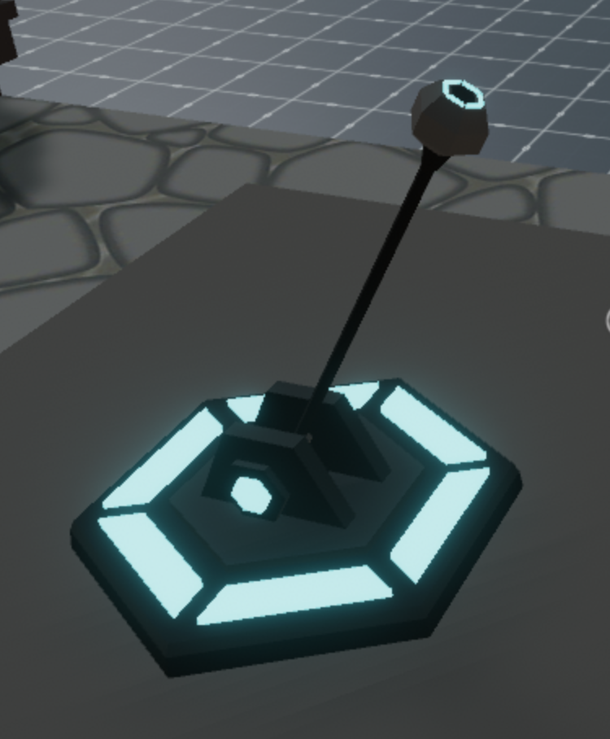

# Paid Lever

A simple scene that uses the `decentraland-crypto-utils` library to make a MANA payment

The crypto Utils function makes it a lot simpler to perform blockchain functions. Sending MANA from one account to another just takes one line of code using this library.

Feel free to reuse the models and code from this scene!
